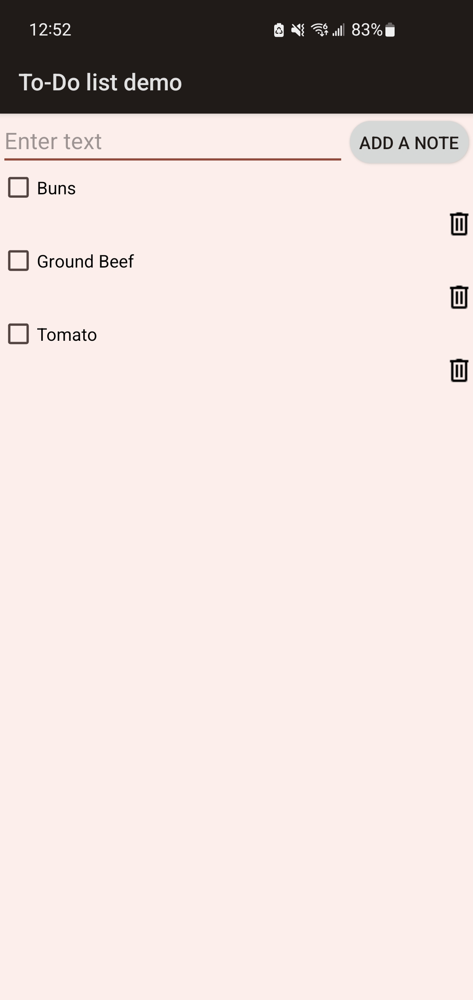

# Checklist App for Android

This is a simple Checklist App for Android that allows you to manage a single checklist by adding and deleting checkboxes. The app provides an intuitive interface to keep track of your tasks and ensure nothing is missed.

## Features

- Add new items to the checklist.
- Delete items from the checklist.
- Mark items as complete by checking the checkboxes.
- Easy-to-use and user-friendly interface.

## Getting Started

### Prerequisites

Before running the app, ensure that you have the following installed:

1. Android Studio: [Download and Install Android Studio](https://developer.android.com/studio) or Visual Studio: [Download and Install Visual Studio](https://visualstudio.microsoft.com/downloads/)
2. Android Device or Android Emulator

### Running the App on an Android Device

1. Connect your Android device to your computer using a USB cable.

2. Make sure USB Debugging is enabled on your device. If you haven't enabled it yet, follow the instructions provided in the [Android Developer Documentation](https://developer.android.com/studio/debug/dev-options) to enable USB Debugging.

3. Open the project in Android Studio or Visual Studio

4. Select your connected Android device as the deployment target.

5. Click on the "Run" button in to build and run the app on your Android device.

### Running the App on an Android Emulator

1. Open Android Studio or Visual Studio.

2. Create a new Android Virtual Device if you haven't already.

3. Select the desired AVD from the list of available emulators.

4. Click on the "Run" button in Android Studio to build and run the app on the selected Android emulator.

## How to Use the App

1. Open the Checklist App on your Android device or emulator.

2. To add a new item to the checklist, enter the text you would like to add and hit the **`ADD A NOTE`** button at the top.

3. To mark an item as completed, tap the checkbox next to it.

4. To delete an item from the checklist, hit the garbage can icon after adding a note.

5. Manage your checklist by adding, completing, and deleting items as needed.

Feel free to edit and play with the code as needed! This was one of my first Android applications developed and I'm excited to work on more in the future. If you have any questions or comments feel free to reach out to me.
